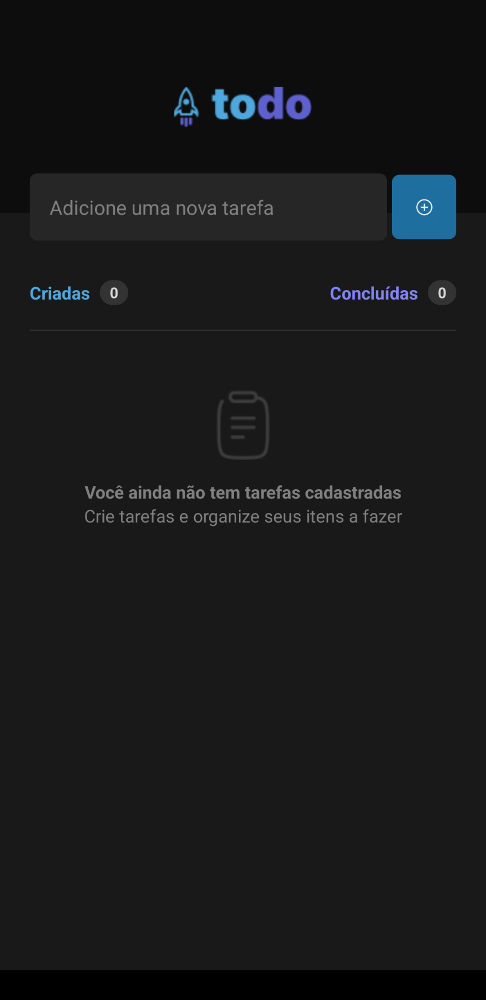
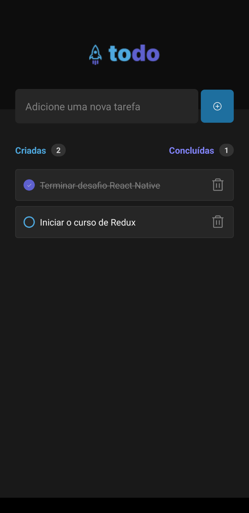

## Todolist ✅

### Sobre:

Durante este desafio, desenvolvemos uma aplicação completa do total zero, contando com apenas um design do Figma e algumas dicas no Notion. Todolist é o desafio inicial do primeiro módulo de expecilização em React Native da Rocketseat, trabalhando funcionalidades e conceitos apresentados nesse módulo para desenvolver o app.

Link do projeto:https://todoolistpage.netlify.app/
